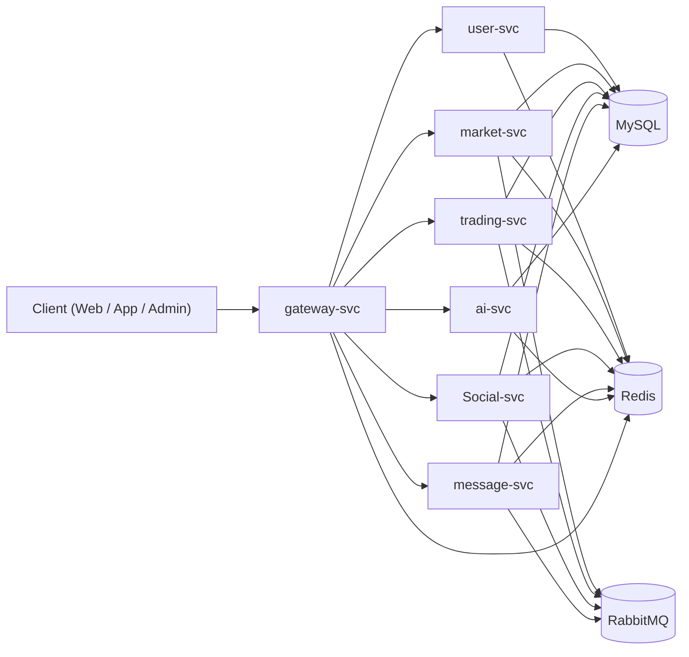

# Trading Platform

一个基于 Spring Cloud 的本地模拟交易平台，包含行情、交易、社区、消息、AI 分析等完整后端能力，适合作为学习型项目、毕业设计或微服务实战模板。
本项目90%以上为ai coding ，是一个vibe coding个人练习项目

## 1. 项目定位

本项目聚焦「本地模拟交易」场景，核心目标是：

- 提供统一的用户体系、账户体系与模拟交易能力
- 支持实时行情（REST + WebSocket）与多周期 K 线缓存
- 支持社区内容互动与消息通知
- 提供基础 AI 分析接口（新闻正文分析、K 线缓存分析）
- 采用可扩展的微服务架构，便于后续迭代

## 2. 技术栈

- Java 21
- Spring Boot 3.5.x
- Spring Cloud 2025.x
- Spring Cloud Alibaba（Nacos / Sentinel）
- MyBatis
- MySQL 8+
- Redis
- RabbitMQ
- Seata（当前配置为 file registry）
- OpenFeign
- Knife4j / OpenAPI

## 3. 架构概览



## 4. 模块与端口

| 模块 | 应用名 | 端口 | 说明 |
|---|---|---:|---|
| gateway-svc | gateway-svc | 8080 | 统一入口、路由、JWT 过滤 |
| user-svc | user-svc | 8081 | 用户/管理员认证、资料、关注 |
| market-svc | market-svc | 8082 | 行情、K 线、资产管理、前端 WS |
| trading-svc | trading-svc | 8083 | 账户、下单、持仓、触发成交 |
| Social-svc | Social-svc | 8084 | 新闻、帖子、评论、互动 |
| message-svc | message-svc | 8085 | 站内消息、MQ 消费写库 |
| AI-svc | ai-svc | 8086 | 新闻/K 线分析接口 |
| common | tp-common | - | 公共实体、DTO、工具类 |

> 说明：网关路由按 `/api/{domain}/**` 统一转发，市场 WebSocket 走 `/ws/market`。

## 5. 主要功能

### 5.1 用户与权限

- 普通用户注册/登录
- 管理员注册/登录
- 用户资料维护（昵称、头像、邮箱、密码）
- 用户关注关系

### 5.2 行情与市场

- 资产列表、实时价格、K 线查询
- 市场服务启动后初始化 Redis 行情/K 线缓存
- 支持 REST + Binance WS 组合更新
- 前端可通过 REST 获取 WS 风格快照数据
- 管理员可增删改交易标的、上下架

### 5.3 交易引擎（模拟）

- 账户余额/冻结余额管理
- 市价单、挂单、触发单
- 持仓管理（加仓、部分平仓、全平）
- 杠杆、强平价计算、流水落库
- 挂单触发链路：价格变动事件 -> MQ -> 订单检查 -> 成交

### 5.4 社区与消息

- 新闻、帖子、评论、点赞/收藏
- 帖子评论触发消息队列通知作者
- message-svc 消费通知并写入站内消息

### 5.5 AI 能力

- 按新闻正文输出简要分析
- 按 Redis K 线缓存输出简要分析

## 6. 数据与中间件

### 6.1 数据库

- 默认连接：`127.0.0.1:3306`
- 默认库：`trading_platform`
- 默认用户：`root / 123456`
- 初始化脚本：`trading.sql`

### 6.2 Redis

- 默认连接：`127.0.0.1:6379`
- 默认 DB：`0`
- 行情/K 线关键缓存前缀：
  - `market:price:{SYMBOL}`
  - `market:kline:{SYMBOL}:{TIMEFRAME}`

### 6.3 RabbitMQ

- 默认连接：`127.0.0.1:5672`
- 默认账号：`guest / guest`
- 用于价格变动、评论通知、订单触发等异步链路

### 6.4 注册与治理

- Nacos：`127.0.0.1:8848`
- Sentinel Dashboard：`127.0.0.1:8858`
- Seata Server：`127.0.0.1:8091`

## 7. 快速启动

### 7.1 环境准备

- JDK 21
- Maven 3.9+
- MySQL 8+
- Redis
- RabbitMQ
- Nacos
- Sentinel
- Seata（可按需）

### 7.2 初始化数据库

```sql
source trading.sql;
```

### 7.3 启动顺序（建议）

1. 启动基础中间件（MySQL / Redis / RabbitMQ / Nacos / Sentinel / Seata）
2. 启动业务服务：
   - `user-svc`
   - `market-svc`
   - `trading-svc`
   - `Social-svc`
   - `message-svc`
   - `ai-svc`
3. 最后启动 `gateway-svc`

### 7.4 本地访问

- 网关入口：`http://127.0.0.1:8080`
- Swagger（示例）：`http://127.0.0.1:8080/swagger-ui.html`
- 各服务也开放自身 `swagger-ui.html`（端口见上表）

## 8. 配置说明

所有服务 `application.yaml` 默认支持以下环境变量覆盖：

- `NACOS_SERVER_ADDR`, `NACOS_USERNAME`, `NACOS_PASSWORD`
- `REDIS_HOST`, `REDIS_PORT`, `REDIS_DATABASE`
- `RABBITMQ_HOST`, `RABBITMQ_PORT`, `RABBITMQ_USERNAME`, `RABBITMQ_PASSWORD`
- `JWT_SECRET`, `JWT_EXPIRE_SECONDS`
- `SEATA_SERVER_ADDR`, `SENTINEL_DASHBOARD`

AI 服务额外支持：

- `DEEPSEEK_API_KEY`
- `DEEPSEEK_BASE_URL`
- `DEEPSEEK_CHAT_MODEL`

## 9. API 概览（网关路径）

### 9.1 用户模块

- `/api/users/auth/*`
- `/api/users/admin/auth/*`
- `/api/users/profile/*`
- `/api/users/follows/*`

### 9.2 市场模块

- `/api/market/assets`
- `/api/market/price/{symbol}`
- `/api/market/kline/{symbol}`
- `/api/market/frontend/price/{symbol}`
- `/api/market/admin/assets/*`
- `/ws/market`（WebSocket）

### 9.3 交易模块

- `/api/trading/account/*`
- `/api/trading/orders/*`

### 9.4 社区模块

- `/api/social/content/list`
- `/api/social/categories`
- `/api/social/posts/*`
- `/api/social/admin/*`

### 9.5 消息模块

- `/api/message/users/messages/*`

### 9.6 AI 模块

- `/api/ai/analysis/news/{newsId}`
- `/api/ai/analysis/kline/{symbol}`

## 10. WebSocket 使用（市场）

连接地址（经网关）：

- `ws://127.0.0.1:8080/ws/market`

订阅示例：

```json
{"op":"subscribe","args":["quote:BTCUSDT","kline:BTCUSDT:1m"]}
```

取消订阅示例：

```json
{"op":"unsubscribe","args":["kline:BTCUSDT:1m"]}
```

心跳示例：

```json
{"op":"ping","ts":1710000000000}
```

## 11. 项目结构

```text
tview/
├─ common/
├─ gateway-svc/
├─ user-svc/
├─ market-svc/
├─ trading-svc/
├─ Social-svc/
├─ message-svc/
├─ AI-svc/
├─ trading.sql
├─ ENTITY_CLASS_REFERENCE.md
├─ trading_platform_overall_architecture.md
└─ 项目文档.md
```

## 12. 开发规范（建议）

- 所有服务统一走网关对外暴露
- 变更接口时同步更新 DTO 与注释
- 涉及资金/订单逻辑必须保证事务边界清晰
- MQ 消费逻辑建议幂等（可结合 `mq_message_log`）
- 新增缓存 key 需统一前缀规范
- 提交前检查文件编码为 UTF-8 无 BOM

## 13. 常见问题

### 13.1 http 连接超时报错

- 检查 网络情况，接口调用需科学上网
- 开启tun(虚拟网卡）模式能够有效解决连接超时问题，这个功能很考验代理平台的网络稳定性
- 注意笔记本等移动设备运行时尽量不要开启移动热点

### 13.2 ai分析无法使用

- 检查`application.yaml`文件的api密钥配置
- 检查api密钥是否能正常使用

### 13.3 K 线无数据

- 检查上架的金融标的物是否有相关字段，只有特定字段才会扫描
- 检查 `asset_info` 是否有可用标的（`status=1`）
- 检查 Redis 键 `market:kline:{symbol}:{timeframe}` 是否存在
- 检查 market-svc 的 REST/WS 抓取配置

## 14. 声明
- 项目处于初级阶段，接口未充分测试，运行时很可能出现报错
- 本项目仅用于学习与技术验证，不构成任何投资建议。
- 默认交易均为模拟盘，不涉及真实资金。
